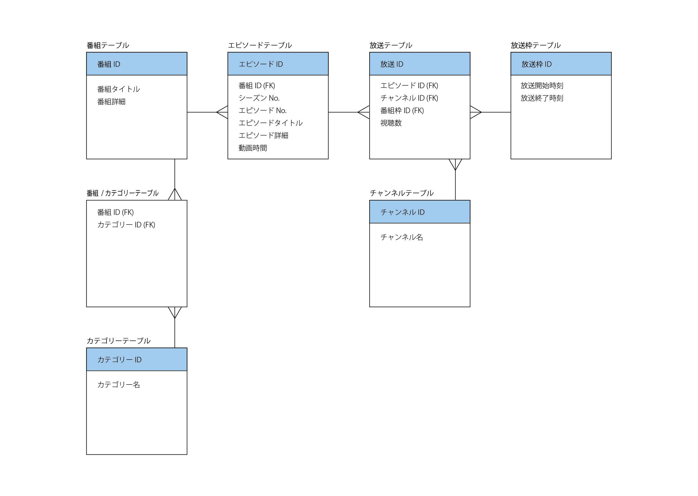

# インターネットTV 提出QUEST

## ステップ1. テーブル設計

まずはテーブル設計を行います。

### ER図

分かりやすさのため、ER図は日本語で書きました。  
実際のテーブル名は以下のようになります。

- 番組テーブル → programs
- カテゴリーテーブル → categories
- 番組/カテゴリーテーブル → programs_categories
- エピソードテーブル → episodes
- 放送テーブル → broadcasts
- 放送枠テーブル → broadcast_slots
- チャンネルテーブル → channels



### 1. programs

テレビ番組の情報を管理するテーブルです。

|カラム名|データ型|NULL|キー|初期値|AUTO INCREMENT|
| ---- | ---- | ---- | ---- | ---- | ---- |
|id|INT||PRIMARY||YES|
|title|VARCHAR(20)||INDEX|||
|description|VARCHAR(100)|YES||||

- タイトルで検索することが多そうなので、INDEXを設定。

### 2. categories

カテゴリー名を管理するテーブルです。

|カラム名|データ型|NULL|キー|初期値|AUTO INCREMENT|
| ---- | ---- | ---- | ---- | ---- | ---- |
|id|INT||PRIMARY||YES|
|name|VARCHAR(20)|||||

- ユニークキー制約：name カラムに対して設定。

### 3. programs_categories

programs と categories の中間テーブルです。

|カラム名|データ型|NULL|キー|初期値|AUTO INCREMENT|
| ---- | ---- | ---- | ---- | ---- | ---- |
|program_id|INT|||||
|category_id|INT|||||

- 外部キー制約：program_id に対して、programs テーブルの id カラムから設定
- 外部キー制約：category_id に対して、categories テーブルの id カラムから設定

### 4. episodes

各テレビ番組がもつ各エピソードの情報を管理するテーブルです。

|カラム名|データ型|NULL|キー|初期値|AUTO INCREMENT|
| ---- | ---- | ---- | ---- | ---- | ---- |
|id|INT||PRIMARY||YES|
|program_id|INT|||||
|season_no|INT|||||
|episode_no|INT|||||
|title|VARCHAR(20)|||||
|description|VARCHAR(100)|YES||||
|play_time|TIME|||||

- 外部キー制約：program_id に対して、programs テーブルの id カラムから設定

### 5. broadcasts

各エピソードが、どのチャンネルのどの放送枠かという情報と、その視聴数を管理するテーブルです。

|カラム名|データ型|NULL|キー|初期値|AUTO INCREMENT|
| ---- | ---- | ---- | ---- | ---- | ---- |
|id|INT||PRIMARY||YES|
|episode_id|INT|||||
|channel_id|INT|||||
|broadcast_slot_id|INT|||||
|views|INT|||||

- 外部キー制約：episode_id に対して、episodes テーブルの id カラムから設定
- 外部キー制約：channel_id に対して、channels テーブルの id カラムから設定
- 外部キー制約：broadcast_slot_id に対して、broadcast_slots テーブルの id カラムから設定

### 6. broadcast_slots

放送枠を管理するテーブルです。

|カラム名|データ型|NULL|キー|初期値|AUTO INCREMENT|
| ---- | ---- | ---- | ---- | ---- | ---- |
|id|INT||PRIMARY||YES|
|start_time|DATETIME|||||
|end_time|DATETIME|||||

### 7. channels

チャンネル名を管理するテーブルです。

|カラム名|データ型|NULL|キー|初期値|AUTO INCREMENT|
| ---- | ---- | ---- | ---- | ---- | ---- |
|id|INT||PRIMARY||YES|
|name|VARCHAR(20)|||||

- ユニークキー制約：name カラムに対して設定。

**NOT NULL制約について**  
NOT NULL制約をつけるべきカラムについてはまだ学習中です...   
今回は、programs の title、episodes の program_id、broadcasts の episode_id のみにつけることにしました。

## ステップ2. テーブル構築

ステップ1で設計したテーブルをMySQLで構築していきます。

### 1. データベース構築

MySQL起動

```bash
sudo service mysql start
```

MySQLにRoot権限を持つユーザーでログイン

```bash
mysql -u ユーザー名 -p
```

データベース `internet_tv` を作成

```sql
CREATE DATABASE internet_tv;
```

作成したデータベースを選択

```sql
USE internet_tv;
```

### 2. テーブル構築

#### programs テーブル

まずは `programs` テーブルを作っていきます。

```sql
CREATE TABLE programs (
  PRIMARY KEY (id),
  INDEX index_title (title),
  id INT AUTO_INCREMENT,
  title VARCHAR(20) NOT NULL,
  description VARCHAR(100)
);
```

テーブルがちゃんと作成できたか確認してみます。

```sql
DESC programs;
```

出力結果は以下です。ちゃんとできているようです。

```sql
+-------------+--------------+------+-----+---------+----------------+
| Field       | Type         | Null | Key | Default | Extra          |
+-------------+--------------+------+-----+---------+----------------+
| id          | int          | NO   | PRI | NULL    | auto_increment |
| title       | varchar(20)  | NO   | MUL | NULL    |                |
| description | varchar(100) | YES  |     | NULL    |                |
+-------------+--------------+------+-----+---------+----------------+
```

もしテーブル構築の時に何かしら間違えてしまった場合は、テーブルをいったん消してやり直すのが速そうです。

```sql
DROP TABLE programs;
```

続いて、他のテーブルも作成していきます。  
テーブルを作成する順番については、外部キーの参照先を先に作らないといけないことに注意します。例えば `broadcasts` テーブルには 3 つの外部キーを設定しており、`episodes`、`channels`、`broadcast_slots` を参照しているため、この 3 つのテーブルが無い状態では `broadcasts` テーブルは作れません。

#### categories テーブル

```sql
CREATE TABLE categories (
  PRIMARY KEY (id),
  id INT AUTO_INCREMENT,
  name VARCHAR(20) UNIQUE
);
```

#### programs_categories テーブル

```sql
CREATE TABLE programs_categories (
  program_id INT,
  category_id INT,
  FOREIGN KEY (program_id) REFERENCES programs(id),
  FOREIGN KEY (category_id) REFERENCES categories(id)
);
```

#### episodes テーブル

```sql
CREATE TABLE episodes (
  PRIMARY KEY (id),
  id INT AUTO_INCREMENT,
  program_id INT NOT NULL,
  season_no INT,
  episode_no INT,
  title VARCHAR(20),
  description VARCHAR(100),
  play_time TIME,
  FOREIGN KEY (program_id) REFERENCES programs(id)
);
```

#### broadcast_slots テーブル

```sql
CREATE TABLE broadcast_slots (
  PRIMARY KEY (id),
  id INT AUTO_INCREMENT,
  start_time DATETIME,
  end_time DATETIME
);
```

#### channels テーブル

```sql
CREATE TABLE channels (
  PRIMARY KEY (id),
  id INT AUTO_INCREMENT,
  name VARCHAR(20) UNIQUE
);
```

#### broadcasts テーブル

```sql
CREATE TABLE broadcasts (
  PRIMARY KEY (id),
  id INT AUTO_INCREMENT,
  episode_id INT NOT NULL,
  channel_id INT,
  broadcast_slot_id INT,
  views INT,
  FOREIGN KEY (episode_id) REFERENCES episodes(id),
  FOREIGN KEY (channel_id) REFERENCES channels(id),
  FOREIGN KEY (broadcast_slot_id) REFERENCES broadcast_slots(id)
);
```

### 3. サンプルデータ

サンプルデータ挿入用クエリは、[sample_data.sql](sample_data.sql) で確認できます。    
ターミナルで以下のコマンドを実行するとサンプルデータが挿入されます。  
ユーザー名の部分には、Root権限を持つユーザー名を入れてください。  

```bash
mysql -u ユーザー名 -p internet_tv < sample_data.sql
```

## ステップ3 データ抽出

データを抽出するクエリです。

1. よく見られているエピソードを知りたいです。エピソード視聴数トップ3のエピソードタイトルと視聴数を取得してください

```sql
SELECT episodes.title AS episode_title,
       SUM(views) AS views_sum
  FROM episodes
       LEFT JOIN broadcasts
       ON episodes.id = broadcasts.episode_id
 GROUP BY episodes.id
 ORDER BY views_sum DESC
 LIMIT 3;
```

出力結果：

```sql
+---------------------+-----------+
| episode_title       | views_sum |
+---------------------+-----------+
| 日常の始まり2       |      5594 |
| 歴史の真実          |      4601 |
| 星との誓い          |      4469 |
+---------------------+-----------+
```

2. よく見られているエピソードの番組情報やシーズン情報も合わせて知りたいです。エピソード視聴数トップ3の番組タイトル、シーズン数、エピソード数、エピソードタイトル、視聴数を取得してください

```sql
SELECT programs.title AS program_title,
       episodes.season_no,
       episodes.episode_no,
       episodes.title AS episode_title,
       SUM(views) AS views_sum
  FROM episodes
       LEFT JOIN broadcasts
       ON episodes.id = broadcasts.episode_id
       LEFT JOIN programs
       ON episodes.program_id = programs.id
 GROUP BY episodes.id
 ORDER BY views_sum DESC
 LIMIT 3;
```

出力結果：

```sql
+--------------------+-----------+------------+---------------------+-----------+
| program_title      | season_no | episode_no | episode_title       | views_sum |
+--------------------+-----------+------------+---------------------+-----------+
| 冒険者の日常       |         1 |          2 | 日常の始まり2       |      5594 |
| 歴史の舞台裏       |         1 |          1 | 歴史の真実          |      4601 |
| 宇宙ロマン         |         1 |          2 | 星との誓い          |      4469 |
+--------------------+-----------+------------+---------------------+-----------+
```

3. 本日の番組表を表示するために、本日、どのチャンネルの、何時から、何の番組が放送されるのかを知りたいです。本日放送される全ての番組に対して、チャンネル名、放送開始時刻(日付+時間)、放送終了時刻、シーズン数、エピソード数、エピソードタイトル、エピソード詳細を取得してください。なお、番組の開始時刻が本日のものを本日方法される番組とみなすものとします

```sql
SELECT channels.name AS channel_name,
       broadcast_slots.start_time,
       broadcast_slots.end_time,
       episodes.season_no,
       episodes.episode_no,
       episodes.title AS episode_title,
       episodes.description
  FROM broadcasts
       LEFT JOIN broadcast_slots
       ON broadcasts.broadcast_slot_id = broadcast_slots.id
       LEFT JOIN episodes
       ON broadcasts.episode_id = episodes.id
       LEFT JOIN channels
       ON broadcasts.channel_id = channels.id
 WHERE broadcast_slots.start_time BETWEEN '2023-11-12 00:00:00' AND '2023-11-12 23:59:59'
 ORDER BY broadcast_slots.start_time;
```

出力結果：

```sql
+--------------------------+---------------------+---------------------+-----------+------------+--------------------+---------------------------------------------------------------------------------+
| channel_name             | start_time          | end_time            | season_no | episode_no | episode_title      | description                                                                     |
+--------------------------+---------------------+---------------------+-----------+------------+--------------------+---------------------------------------------------------------------------------+
| スペシャル2              | 2023-11-12 16:30:00 | 2023-11-12 18:00:00 |         1 |          1 | 未知の領域         | 科学の新たな発見を追求する番組の第1話。                                         |
| ニュース                 | 2023-11-12 21:00:00 | 2023-11-12 22:30:00 |         1 |          2 | 瞬間の決断         | 予測不能な出来事に素早く対応するニュース特番の第2話。                           |
| ファミリーアニメ         | 2023-11-12 22:30:00 | 2023-11-12 23:00:00 |         2 |          2 | 冒険の始まり       | ファンタジーの世界で冒険するアニメの第4話。                                     |
| アニメ                   | 2023-11-12 23:00:00 | 2023-11-12 23:30:00 |         2 |          2 | 冒険の始まり       | ファンタジーの世界で冒険するアニメの第4話。                                     |
| ニュース                 | 2023-11-12 23:00:00 | 2023-11-12 23:30:00 |         1 |          3 | 瞬間の決断         | 予測不能な出来事に素早く対応するニュース特番の第3話。                           |
| スポーツ                 | 2023-11-12 23:00:00 | 2023-11-12 23:30:00 |         1 |          1 | 熱血の戦い         | プロ格闘家たちによるバトルの模様を伝える番組の第1話。                           |
| ドラマ                   | 2023-11-12 23:00:00 | 2023-11-12 23:30:00 |         1 |          2 | 星との誓い         | 宇宙を舞台にしたロマンチックドラマの第2話。                                     |
+--------------------------+---------------------+---------------------+-----------+------------+--------------------+---------------------------------------------------------------------------------+
```

4. ドラマというチャンネルがあったとして、ドラマのチャンネルの番組表を表示するために、本日から一週間分、何日の何時から何の番組が放送されるのかを知りたいです。ドラマのチャンネルに対して、放送開始時刻、放送終了時刻、シーズン数、エピソード数、エピソードタイトル、エピソード詳細を本日から一週間分取得してください

```sql
SELECT broadcast_slots.start_time,
       broadcast_slots.end_time,
       episodes.season_no,
       episodes.episode_no,
       episodes.title AS episode_title,
       episodes.description
  FROM broadcasts
       LEFT JOIN broadcast_slots
       ON broadcasts.broadcast_slot_id = broadcast_slots.id
       LEFT JOIN episodes
       ON broadcasts.episode_id = episodes.id
       LEFT JOIN channels
       ON broadcasts.channel_id = channels.id
 WHERE channels.name = 'ドラマ'
   AND broadcast_slots.start_time BETWEEN '2023-11-12 00:00:00' AND '2023-11-18 23:59:59'
 ORDER BY broadcast_slots.start_time;
```

出力結果：

```sql
+---------------------+---------------------+-----------+------------+--------------------+------------------------------------------------------------------+
| start_time          | end_time            | season_no | episode_no | episode_title      | description                                                      |
+---------------------+---------------------+-----------+------------+--------------------+------------------------------------------------------------------+
| 2023-11-12 23:00:00 | 2023-11-12 23:30:00 |         1 |          2 | 星との誓い         | 宇宙を舞台にしたロマンチックドラマの第2話。                      |
| 2023-11-13 19:30:00 | 2023-11-13 21:00:00 |         1 |          1 | 正義の呼び声       | アクション満載のヒーローシリーズの第1話。                        |
| 2023-11-13 22:30:00 | 2023-11-13 23:00:00 |         1 |          3 | 星との誓い         | 宇宙を舞台にしたロマンチックドラマの第3話。                      |
| 2023-11-15 19:30:00 | 2023-11-15 21:00:00 |         1 |          1 | 正義の呼び声       | アクション満載のヒーローシリーズの第1話。                        |
| 2023-11-15 21:00:00 | 2023-11-15 22:30:00 |         1 |          1 | 恋の始まり         | オリジナルな恋愛模様を描いたドラマの第1話。                      |
| 2023-11-15 23:00:00 | 2023-11-15 23:30:00 |         1 |          2 | 星との誓い         | 宇宙を舞台にしたロマンチックドラマの第2話。                      |
| 2023-11-16 16:30:00 | 2023-11-16 18:00:00 |         1 |          1 | 星との誓い         | 宇宙を舞台にしたロマンチックドラマの第1話。                      |
+---------------------+---------------------+-----------+------------+--------------------+------------------------------------------------------------------+
```

5. 直近一週間で最も見られた番組が知りたいです。直近一週間に放送された番組の中で、エピソード視聴数合計トップ2の番組に対して、番組タイトル、視聴数を取得してください

```sql
SELECT t1.title, SUM(t2.sum) AS total_sum
  FROM programs AS t1
       JOIN
       (SELECT episodes.program_id,
               broadcasts.episode_id,
               SUM(views) AS sum
       FROM broadcasts
       JOIN broadcast_slots
       ON broadcasts.broadcast_slot_id = broadcast_slots.id
       JOIN episodes
       ON broadcasts.episode_id = episodes.id
       WHERE broadcast_slots.start_time BETWEEN '2023-11-06 00:00:00' AND '2023-11-12 23:59:59'
       GROUP BY broadcasts.episode_id) AS t2
       ON t1.id = t2.program_id
 GROUP BY t1.id
 ORDER BY total_sum DESC
 LIMIT 2;
```

出力結果：

```sql
+-----------------+-----------+
| title           | total_sum |
+-----------------+-----------+
| 幻想の王国      |      7997 |
| 宇宙ロマン      |      5906 |
+-----------------+-----------+
```

6. ジャンルごとの番組の視聴数ランキングを知りたいです。番組の視聴数ランキングはエピソードの平均視聴数ランキングとします。ジャンルごとに視聴数トップの番組に対して、ジャンル名、番組タイトル、エピソード平均視聴数を取得してください。

作成中...